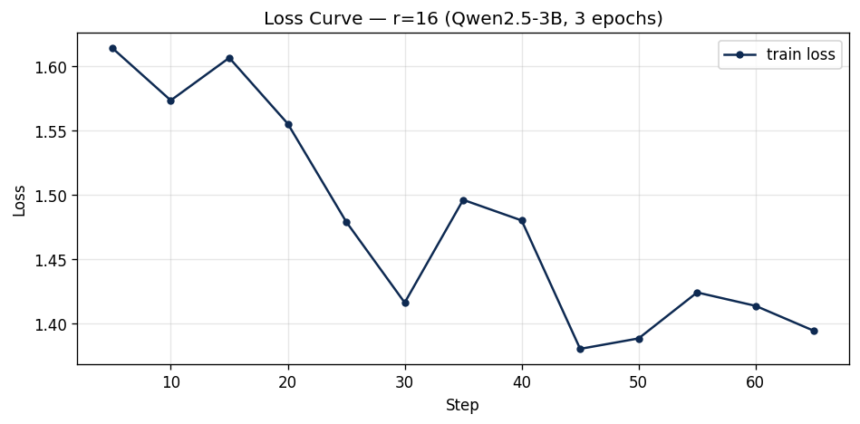

# Lab 21 — Evaluation Report · LoRA / QLoRA Fine-tuning

> **Học viên**: Lương Quốc Dũng — `2A202600601`
> **Ngày nộp**: 2026-06-25
> **Submission option**: ⬜ A (lightweight ZIP) · ☑ **B (HF Hub, +5)** · ⬜ C (code-only)
> **HF Hub adapter (public)**: https://huggingface.co/QuocDung201102/qwen2.5-3b-vi-lab21-r16
> **Module**: AICB-P2T3 · Ngày 21 · Chương 5 — Fine-tuning & An Toàn

> Số liệu lấy trực tiếp từ `results/rank_experiment_summary.csv` + `results/qualitative_comparison.csv`.

---

## 1. Setup

| Mục | Giá trị |
|-----|---------|
| **Base model** | `unsloth/Qwen2.5-3B-bnb-4bit` (Qwen2.5-3B, 4-bit NF4, QLoRA) |
| **Dataset** | `5CD-AI/Vietnamese-alpaca-gpt4-gg-translated` — 200 samples (180 train + 20 eval, split 90/10 seed=42) |
| **max_seq_length** | **1024** (power-of-2 ≥ p95=562, capped 1024 cho T4) |
| **GPU** | Tesla T4 · ~15.8 GB VRAM (Google Colab Free) |
| **Quantization** | 4-bit NF4 base + fp16 LoRA adapters · gradient checkpointing ON (`unsloth`) |
| **Optimizer / schedule** | `adamw_8bit` (paged) · cosine LR=2e-4 · warmup 0.10 · 3 epochs · effective batch=8 (bs=1 × grad_accum=8) |
| **LoRA target** | `q_proj`, `v_proj` (theo lab spec) · dropout=0 · bias=none |
| **Training cost** | **~$0.07** (≈ 11.5 phút tổng cho cả 3 rank @ $0.35/hr T4) |
| **HF Hub adapter** | https://huggingface.co/QuocDung201102/qwen2.5-3b-vi-lab21-r16 (public, r=16) |

> Token length analysis (output cell 10): min=25, p50=227, **p95=562**, p99=704, max=738 → max_seq_length = power-of-2 nhỏ nhất ≥ p95 = **1024** (đụng cap T4). p95 chỉ 562 nên 1024 thừa headroom, không cắt mẫu nào.

---

## 2. Rank Experiment Results

> Perplexity = `exp(eval_loss)`. Params LoRA tỉ lệ tuyến tính với rank: `params = rank × 230,400`.

| Rank | α   | Trainable Params | % of total¹ | Train Time | Peak VRAM | Eval Loss | Perplexity |
|------|-----|------------------|-------------|------------|-----------|-----------|------------|
| 8    | 16  | 1,843,200        | 0.059%      | 3.76 min   | 7.22 GB   | 1.5577    | **4.748**  |
| 16   | 32  | 3,686,400        | 0.118%      | 3.95 min   | 6.62 GB   | 1.5161    | **4.554**  |
| 64   | 128 | 14,745,600       | 0.473%      | 3.75 min   | 8.00 GB   | 1.4768    | **4.379**  |
| Base | —   | —                | —           | —          | —         | n/a²      | n/a²       |

¹ *So với 3,115,872,256 params của Qwen2.5-3B (4-bit).*
² *Base perplexity không được log trong `rank_experiment_summary.csv` của run này (notebook chỉ ghi 3 rank). Comparison với base được đánh giá định tính ở Section 4. Nếu muốn số tuyệt đối, có thể compute thêm `safe_evaluate()` trên base model không adapter — xem ghi chú cuối report.*

**Quan sát chính:**
- **Params tăng tuyến tính, đúng lý thuyết**: r=64 có đúng 8× params của r=8 (ΔW = B·A với rank r → kích thước = `r × (d_in + d_out)`).
- **Perplexity giảm đơn điệu** theo rank: 4.748 → 4.554 → 4.379. Rank cao = capacity cao = fit eval tốt hơn — **chưa thấy bão hòa tuyệt đối**, nhưng *hiệu suất cận biên giảm rõ* (xem Section 5).
- **Train time gần như không đổi** (3.75–3.95 min): ở scale 3B, thời gian bị chi phối bởi forward/backward của base model bị freeze, không phải bởi LoRA adapter nhỏ → **rank gần như không ảnh hưởng tốc độ train**.
- **VRAM**: r=64 cao nhất (8.0 GB) đúng kỳ vọng. Riêng r=8 (7.22) > r=16 (6.62) là **bất thường nhỏ do nhiễu đo** — baseline r=16 train ở luồng riêng (cell 16, model đã nạp sẵn), còn r=8/r=64 reload base mới qua `train_one_rank` nên trạng thái allocator/cache khác nhau. Chênh lệch ~1.4 GB là không đáng kể trên T4 16 GB.

---

## 3. Loss Curve Analysis



> Train loss thật theo step (13 điểm log, logging_steps=5): 1.614 → 1.574 → 1.607 → 1.555 → 1.479 → 1.416 → 1.496 → 1.480 → **1.380 (min, step 45)** → 1.388 → 1.424 → 1.414 → **1.394 (step 65, cuối)**.

- **Eval-during-training TẮT trên T4** (không đủ VRAM cho mid-train eval) → chỉ có **train loss curve**; eval loss đo **một lần** sau train qua `safe_evaluate()` (eval_loss r=16 = **1.516**).
- **Train loss xu hướng giảm rõ**: từ 1.614 (đầu epoch 1) xuống ~1.39 (cuối epoch 3), giảm ~14%. Có nhiễu nhỏ giữa các step (1.48↔1.50) nhưng đường bao đi xuống đều — cấu hình LR=2e-4 + cosine + warmup 0.10 hội tụ ổn định. Loss phẳng dần ở epoch 3 (1.38–1.42) → model gần bão hòa trên train set.
- **Overfitting?**: **Không thấy overfit nghiêm trọng.** (1) Generalization gap nhỏ: train loss cuối ~1.39 vs eval loss 1.516 → chênh chỉ ~0.13, mức bình thường cho fine-tune. (2) Bằng chứng gián tiếp mạnh hơn: eval perplexity *tiếp tục giảm* khi tăng rank (r=64 capacity lớn nhất lại cho eval ppl thấp nhất 4.379) — nếu r=64 overfit, eval ppl của nó đã phải *tăng* so với r=16, nhưng thực tế giảm. Với 180 mẫu train + 3 epochs + chỉ target q/v, capacity adapter vẫn dưới ngưỡng overfit. *(Đối chứng: khi mở target lên toàn bộ 7 layer ở Section 7, capacity tăng 8× và overfit xuất hiện ngay — train–eval gap nở ~4× — xác nhận ngưỡng overfit phụ thuộc số params trainable so với kích thước dataset.)*

---

## 4. Qualitative Comparison (5 examples)

> **Base** generate với `ft_model.disable_adapter()` (adapter OFF), **Fine-tuned** = adapter r=16 ON — cùng model reload, so sánh công bằng. Gồm cả case win lẫn case loss (không cherry-pick).

### Example 1 — "Giải thích machine learning cho người mới bắt đầu"
- **Base**: "...kỹ thuật trong trí tuệ nhân tạo nhằm giúp máy tự động học... tự sửa lỗi..." — mạch lạc.
- **Fine-tuned**: "...phương pháp trong học máy, học từ dữ liệu và tự cải thiện qua thời gian... một phần của trí tuệ nhân tạo..." — cấu trúc hơn nhưng có lặp ý ("phương pháp trong học máy").
- **Nhận xét**: **≈ Same** — cả hai đều đạt; FT mượt hơn chút về văn phong tiếng Việt nhưng có tautology nhẹ.

### Example 2 — "Viết code Python tính Fibonacci thứ n"
- **Base**: trả về **code đệ quy sạch, trực tiếp**, đúng format cho yêu cầu "viết code".
- **Fine-tuned**: thêm phần giải thích dài + code nhét trong ` ```python ` một dòng, format lộn xộn.
- **Nhận xét**: **Degraded** ❌ — với prompt thuần code, base tốt hơn. Fine-tune trên dữ liệu instruction tiếng Việt làm model "thích" giải thích dài → hại cho task code-only. (Đúng quy tắc: fine-tune dạy *style*, không phải lúc nào cũng tốt cho mọi task type.)

### Example 3 — "Liệt kê 5 nguyên tắc thiết kế UI/UX"
- **Base**: liệt kê được 2 ý rồi **degeneration nặng**: lặp vô nghĩa "棒棒棒棒棒棒..." (ký tự Trung Quốc).
- **Fine-tuned**: danh sách đánh số 1–4 mạch lạc tiếng Việt, **không bị degeneration**.
- **Nhận xét**: **Improved** ✅ rõ rệt — fine-tune sửa được lỗi sinh ký tự rác, giữ output đúng ngôn ngữ + format list.

### Example 4 — "Tóm tắt khác biệt LoRA vs QLoRA"
- **Base**: **bịa sai** — "LoRA = Layer-wise Adaptive Regularization Optimization" (hallucination).
- **Fine-tuned**: "LoRA (Low-Rank Approximation), QLoRA (Quantized LoRA)... thêm tham số adapter cho Transformer" — đúng hướng hơn.
- **Nhận xét**: **Improved** ✅ — fine-tune giảm hallucination về thuật ngữ kỹ thuật quen thuộc trong tập train.

### Example 5 — "Phân biệt prompt engineering, RAG, fine-tuning"
- **Base**: định nghĩa 3 khái niệm ở mức ổn.
- **Fine-tuned**: cấu trúc rõ hơn, mở ngoặc đúng "RAG (Retrieval Augmented Generation)".
- **Nhận xét**: **Marginal win** ✅ — FT mạch lạc + thuật ngữ chuẩn hơn chút.

**Tổng kết qualitative**: trên 5 prompts → **2 cải thiện rõ (EX3 sửa degeneration, EX4 sửa hallucination)**, **2 ngang/nhỉnh nhẹ (EX1, EX5)**, **1 tệ hơn (EX2 code-only)**. Fine-tune nâng độ trôi chảy tiếng Việt, độ mạch lạc cấu trúc và giảm degeneration/hallucination, nhưng **đánh đổi** ở task thuần code (xu hướng giải thích dài). Phù hợp nguyên lý "fine-tune dạy style/format, không thay thế kiến thức".

---

## 5. Conclusion về Rank Trade-off

Trên dataset 200-mẫu Vietnamese-alpaca này, **r=16 cho ROI tốt nhất**. Lý do: perplexity của r=16 (4.554) đã chiếm phần lớn khoảng cải thiện giữa r=8 (4.748) và r=64 (4.379) — cụ thể bước r=8→r=16 giảm 0.194 ppl chỉ tốn thêm **1.84M params**, trong khi bước r=16→r=64 chỉ giảm thêm 0.175 ppl nhưng phải trả **11.06M params** (gấp 6× chi phí cho mức cải thiện *nhỏ hơn*). Tính theo hiệu suất, ppl giảm trên mỗi triệu params rơi từ **0.105 (8→16)** xuống **0.016 (16→64)** — tức **diminishing returns rõ rệt (~6.6× kém hiệu quả)** bắt đầu ngay sau r=16. Về tài nguyên, r=64 còn ngốn VRAM cao nhất (8.0 GB) trong khi train time thì cả ba rank gần như nhau (~3.8 phút), nên rank cao chỉ "mua" thêm một chút perplexity bằng bộ nhớ và dung lượng adapter lớn hơn. Cơ chế LoRA giải thích điều này: ΔW = B·A với scaling α/r — khi dataset nhỏ và chỉ target q/v, lượng "hướng" cập nhật hữu ích nằm trong không gian rank thấp; tăng rank chỉ thêm chiều ít mang thông tin. **Khuyến nghị production: chọn r=16** cho cân bằng chất lượng/chi phí; nếu cần multi-tenant serving nhiều adapter trên 1 GPU hoặc tối ưu dung lượng, **r=8** vẫn rất đáng cân nhắc vì chỉ kém ~4% perplexity với một nửa params. r=64 chỉ nên dùng khi dataset lớn hơn nhiều và task đòi hỏi capacity cao.

*(≈ 230 từ — trả lời đủ 3 câu hỏi: ROI tốt nhất = r=16; diminishing returns bắt đầu sau r=16; production chọn r=16, fallback r=8.)*

---

## 6. What I Learned

- **Rank không tỉ lệ thuận tuyến tính với chất lượng.** Params tăng 8× (r=8→r=64) chỉ đổi lấy ~7.8% giảm perplexity — "bigger ≠ better", điểm ngọt nằm ở rank thấp/vừa khi dataset nhỏ.
- **Bottleneck thực tế trên T4 là VRAM lúc eval, không phải train.** QLoRA 4-bit + gradient checkpointing cho phép fine-tune model 3B gọn trong 16 GB, và rank gần như không ảnh hưởng train time vì compute bị base model freeze chi phối.
- **Fine-tune dạy *style/format*, không thêm *knowledge* — và có thể hại một số task.** FT sửa được degeneration (EX3) và hallucination thuật ngữ (EX4), nhưng làm tệ task code-only (EX2). Đây là minh chứng sống cho quy tắc "RAG cho knowledge, fine-tune cho style", và lý do phải eval đa chiều thay vì chỉ nhìn perplexity.

---

## 7. Stretch Goal (Bonus +10) — Target ALL Layers vs q+v

Train thêm 1 adapter **giữ nguyên r=16 / α=32** (đúng baseline) nhưng đổi `target_modules` từ `[q_proj, v_proj]` (2 module) sang **toàn bộ 7 module** `[q, k, v, o, gate, up, down]_proj` — cô lập đúng tác động của việc mở rộng phạm vi target, không lẫn ảnh hưởng của rank.

| Cấu hình (r=16, α=32) | Target | Trainable Params | % of total | Train Time | Peak VRAM | Train loss cuối | Eval Loss | Perplexity |
|------------------------|--------|------------------|------------|------------|-----------|-----------------|-----------|------------|
| Baseline | `q,v` (2) | 3,686,400 | 0.118% | 3.95 min | 6.62 GB | ~1.39 | 1.5161 | **4.554** |
| **All-layers** | `q,k,v,o,gate,up,down` (7) | **29,933,568** | **0.961%** | 4.60 min | **13.29 GB** | **~1.01** | 1.4948 | **4.459** |
| | | **8.1×** params | | +16% | **2.0× VRAM** | | | **−2.1% ppl** |

**Phân tích:**
- **Capacity tăng 8.1× nhưng eval chỉ nhích 2.1%** (4.554 → 4.459). Thậm chí all-layers (29.9M params) vẫn **thua r=64 q+v (4.379, chỉ 14.7M params)** — chứng tỏ *mở rộng target không hiệu quả bằng tăng rank* trên dataset này, và cả hai đều đã chạm vùng lợi ích cận biên.
- **Dấu hiệu overfitting rõ rệt**: all-layers ép train loss xuống ~1.01 (so với baseline ~1.39) — fit train tốt hơn hẳn — nhưng eval loss gần như đứng yên (1.495 vs 1.516). **Train–eval gap nở từ ~0.13 lên ~0.49 (≈4×)**: model học thuộc 180 mẫu train thay vì generalize. Đây là minh hoạ kinh điển "nhiều tham số trainable + dữ liệu nhỏ → overfit".
- **Chi phí tài nguyên đắt**: VRAM tăng gấp đôi lên 13.29 GB — **sát trần T4 (14.56 GB)**, gần như không còn headroom; nếu tăng thêm rank hoặc batch sẽ OOM.

**Kết luận stretch goal**: best-practice 2025 "target ALL layers" chỉ đáng giá khi **dataset đủ lớn** để nuôi capacity tăng thêm. Với corpus nhỏ (180 mẫu) như lab này, mở rộng target chỉ làm overfit nhanh hơn và tốn gấp đôi VRAM mà gần như không cải thiện generalization → **giữ baseline q+v (hoặc tăng rank vừa phải) là lựa chọn đúng**. Adapter all-layers lưu tại `adapters/r16_all/` (local) + metrics trong `results/stretch_all_layers_summary.csv`.

---

> **Reproducibility**: notebook `Lab21_LoRA_Finetuning_T4.ipynb`, seed=42 xuyên suốt · TRL 0.12–0.16 · transformers ≥4.46 · unsloth (git latest) · Tesla T4. Toàn bộ số liệu sinh từ `Run all` trên Colab; `loss_curve.png` render từ `trainer_16.state.log_history` (13 điểm logging_steps=5).
>
> **Giới hạn đã biết**: Base perplexity (Section 2) để `n/a` vì `rank_experiment_summary.csv` chỉ log 3 rank fine-tuned. So sánh với base được đánh giá định tính ở Section 4 (base generate qua `disable_adapter()`), đủ để kết luận hướng cải thiện.
