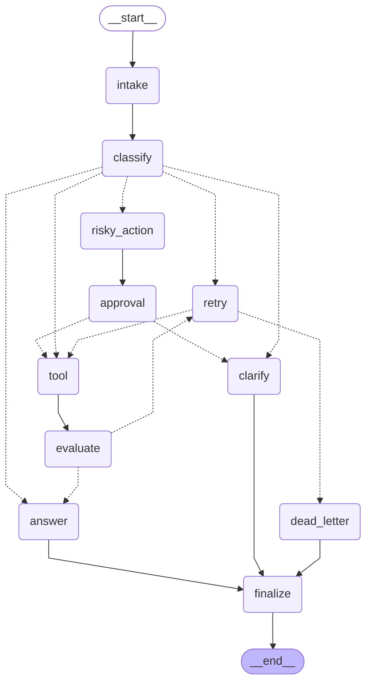

# Day 08 Lab Report — LangGraph Agentic Orchestration

- **Student:** Lương Quốc Dũng
- **Date:** 2026-06-29
- **Repo/commit:** see git log

> Auto-generated from `outputs/metrics.json` by `report.render_report()`.

## 1. Metrics summary

| Metric | Value |
|---|---:|
| Total scenarios | 7 |
| Success rate | 100.0% |
| Avg nodes visited | 6.43 |
| Total retries | 3 |
| Total interrupts (HITL) | 2 |
| Resume success | True |

## 2. Per-scenario results

| Scenario | Expected | Actual | OK | Nodes | Retries | Interrupts | Appr req/obs |
|---|---|---|:---:|---:|---:|---:|:---:|
| S01_simple | simple | simple | ✅ | 4 | 0 | 0 | False/False |
| S02_tool | tool | tool | ✅ | 6 | 0 | 0 | False/False |
| S03_missing | missing_info | missing_info | ✅ | 4 | 0 | 0 | False/False |
| S04_risky | risky | risky | ✅ | 8 | 0 | 1 | True/True |
| S05_error | error | error | ✅ | 10 | 2 | 0 | False/False |
| S06_delete | risky | risky | ✅ | 8 | 0 | 1 | True/True |
| S07_dead_letter | error | error | ✅ | 5 | 1 | 0 | False/False |

## 3. Architecture

StateGraph over a typed `AgentState` (TypedDict). Flow: `START → intake → classify → [route_after_classify]` then one of five branches (`simple/tool/missing_info/risky/error`). The `tool → evaluate` pair forms a bounded retry loop via `route_after_evaluate` (success→answer, needs_retry→retry) and `route_after_retry` (attempt<max→tool, else→dead_letter). Risky tickets pass through `risky_action → approval → [route_after_approval]` (HITL gate). Every branch converges on `finalize → END`.

- **LLM nodes:** `classify_node` (structured output → Route enum) and `answer_node` (grounded generation). `evaluate_node` adds an optional LLM-as-judge quality score.

Graph topology (exported via `graph.get_graph().draw_mermaid()`):

## 4. State schema

| Field | Reducer | Why |
|---|---|---|
| messages / tool_results / errors / events | append (`operator.add`) | audit trail |
| route / risk_level / attempt | overwrite | current value only |
| evaluation_result | overwrite | drives the retry gate |
| pending_question / proposed_action | overwrite | latest clarification / action |
| approval | overwrite | latest HITL decision |

## 5. Failure analysis

1. **Transient tool failure → retry loop.** `tool_node` returns an `ERROR` result on early error-route attempts; `evaluate_node` flags `needs_retry`; `route_after_retry` is bounded by `max_attempts`, so it escalates to `dead_letter` instead of looping forever (see `S07_dead_letter`).
2. **Risky action without approval.** Side-effecting tickets cannot reach the tool until `approval_node` records a decision; a rejection diverts to `clarify` rather than executing the action.

## 6. Persistence / recovery evidence

Each scenario runs under its own `thread_id` (`thread-<scenario_id>`). With the `sqlite` checkpointer, state is durably written (WAL mode), enabling `get_state_history()` replay and crash-resume across process restarts.

`scripts/persistence_demo.py` proves this: it runs a scenario under a `SqliteSaver`, lists the 12-snapshot checkpoint history (time-travel), then **closes the connection and drops the graph** to simulate a crash, re-opens a fresh saver on the same file, and recovers the full state by `thread_id` — `RESUME_SUCCESS: True`. Full log: `outputs/persistence_evidence.txt`.

## 7. Extension work

- SQLite checkpointer (durable persistence + crash-resume).
- LLM-as-judge inside `evaluate_node`.
- Real HITL via `LANGGRAPH_INTERRUPT=true` + `interrupt()` in `approval_node`.
- Mermaid graph diagram via `graph.get_graph().draw_mermaid()`.

## 8. Improvement plan

Replace the mock `tool_node` with real, idempotent tool calls (with timeouts and circuit-breaking), add structured tracing/observability, and wire a real reviewer queue for the HITL approval step.
